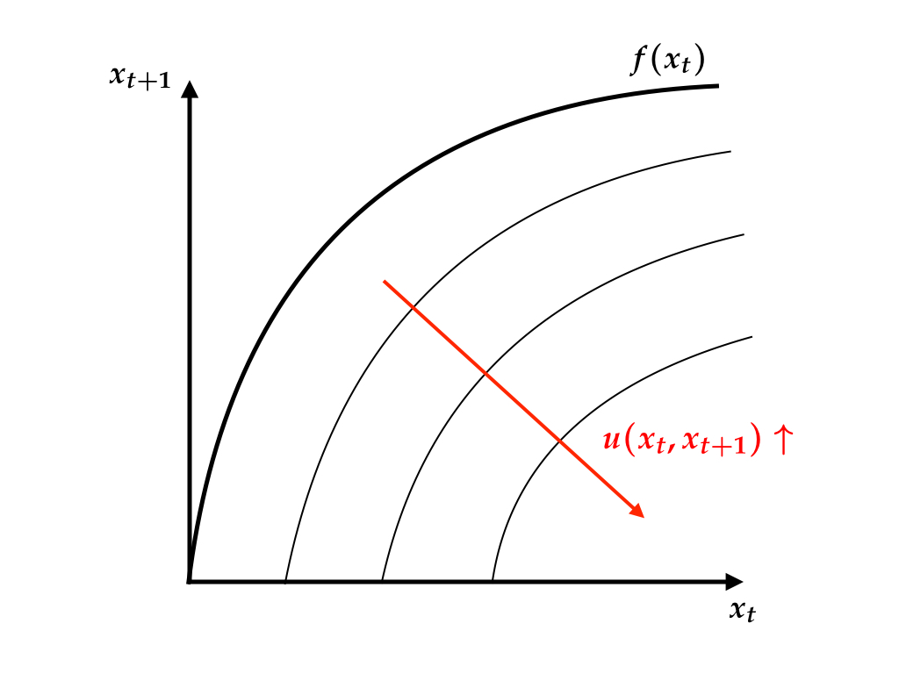

```{r setup, include=FALSE}
knitr::opts_chunk$set(echo = TRUE)
```

# YAML Frontmatter

The biginning section of R Markdown file enclosed with triple dashes is 
called YAML frontmatter. This section specifies how the file is rendered 
into the final output. The hardwork is done by pandoc (bundled with RStudio).

If the final output is PDF, then pandoc passes LaTeX source file (.tex) to 
a LaTeX engine (pdflatex, xelatex, or lualatex) and the latter produces a PDF.

In writing an academic paper, I would recommend to exploit extended 
functionalities achieved with **bookdown** package. See https://bookdown.org/yihui/bookdown/
for more information.

Here are several samples of frontmatters. (To use one of these, you might need to create empty file, `custom_style_file.sty` and `bibliography_file.bib`, in the same folder with your .Rmd file.)

## Short paper {-}

Here is a header for a simple article.

```yml
---
title: 'Title of the paper'
author: | 
  | Your name
  | Affiliation
date: '`r format(Sys.time(), "%d %B, %Y")`'
output:
  bookdown::pdf_document2:
    fig_caption: yes
    includes:
      in_header: custom_style_file.sty
    keep_tex: no
    latex_engine: pdflatex
    template: null
    toc: no
documentclass: scrartcl
link-citations: yes
bibliography: bibliography_file.bib
biblio-style: apalike
---
```

## Long report {-}

Modify `documentclass` field to get a report with a title page. 

```yml
---
title: 'Title of the report'
author: |
  | Your name
  | Affiliation
date: '`r format(Sys.time(), "%d %B, %Y")`'
output:
  bookdown::pdf_document2:
    fig_caption: yes
    includes:
      in_header: custom_style_file.sty
    keep_tex: no
    latex_engine: pdflatex
    template: null
    toc: yes
documentclass: scrreprt
link-citations: yes
bibliography: bibliography_file.bib
biblio-style: apalike
---
```

## HTML Output {-}

HTML output might be handier for drafting.

```yml
---
title: 'Title of the page'
author: |
  | Your name
  | Affiliation
date: '`r format(Sys.time(), "%d %B, %Y")`'
output:
  bookdown::html_document2: default
link-citations: yes
bibliography: bibliography_file.bib
biblio-style: apalike
---
```

## Combination {-}

YAML header accepts multiple entries in `output` field. If your final output is 
PDF article but you want to draft it with HTML, then your header might look like

```yaml
title: 'Title of the paper'
author: | 
  | Your name
  | Affiliation
date: '`r format(Sys.time(), "%d %B, %Y")`'
output:
  bookdown::html_document2: default
  bookdown::pdf_document2:
    fig_caption: yes
    includes:
      in_header: custom_style_file.sty
    keep_tex: no
    latex_engine: pdflatex
    template: null
    toc: no
documentclass: scrartcl
link-citations: yes
bibliography: bibliography_file.bib
biblio-style: apalike
```

## Book {-}

I would recommend to read about **bookdown**, which allows you to 
separate the source file into multiple files for easy composing.
See https://bookdown.org/yihui/bookdown/ 

# Sections

Use pound symbols (#) for sectioning.

```markdown
# Section
## Subsection
### Subsubsection
```

```markdown
# Section without section number {-}
## Subsection without subsection number {-}
### Subsubsection without subsubsection number {-}
```

## Cross reference {-}

You might want to refer the reader to another section within your document. 
To do this, use the following syntax.

```bookdown
\@ref(section-header)
```

For example, the heading for the first section in the present document is "YAML Frontmatter".
Make upper-case letters lower-case and replace a white space for a dash to get "yaml-frontmatter". Section `\@ref(yaml-frontmatter)` is rendered to Section \@ref(yaml-frontmatter).

# Code chunk

There are different reasons you might want to include R code in a document.

* You want to display both code and its output.
* You want to include output (e.g., pictures, graphs, tables) derived from code but you 
  don't want to copy and paste the result.
* You want to show code itself.

It's a very common error to forget to update a graph or table after updating code. It is a good idea to automatically produce, embed and update graphs and/or tables diplayed in the final output.^[Another technique to achieve this goal is to make use of "make". I refere the interested readers to "minimal make" by Karl Broman, http://kbroman.org/minimal_make/] 

**knitr** package does this perfectly. The basic syntax for including code is the 
following:

<pre><code>```{r chunk-label}
plot(pressure)
```</code></pre>

The area surrounded by ` ```{r}` and ` ``` ` is called, R code chunk. The text string 
immediately after `r` is "chunk label". You can use this for cross-referencing.

There are many options (chunk options) to control how the output looks like.

## Show code and output

<pre><code>```{r chunk-label-1}
plot(pressure)
```</code></pre>

displays code and the output graph.

```{r chunk-label-1}
plot(pressure)
```

## Show output but not code


<pre><code>```{r chunk-label-2, echo=FALSE}
plot(pressure)
```</code></pre>

produces

```{r chunk-label-2, echo=FALSE}
plot(pressure)
```


## Show code but not output

<pre><code>```{r chunk-label-3, eval=FALSE}
plot(pressure)
```</code></pre>

produces

```{r chunk-label-3, eval=FALSE}
plot(pressure)
```

Notice that this code chunk is only for show and thus not run.


## Inline code {-}

You might want to manipulate the text body by a code. For example, if you have 
done a regression analysis

```{r}
model <- lm(pressure ~ temperature, pressure)
smmry <- summary(model)
```

you might want to include important figures in your document. 
Instead of writing the raw numbers many times, you can write `` `r '\x60r smmry$coefficients[2, 1]\x60'` `` to include the coefficient, `r smmry$coefficients[2, 1]`
for the regressor. To include, standard error, `r smmry$coefficients[2, 2]`,   `` `r '\x60r smmry$coefficients[2, 2]\x60'` ``
can be used.

This might seem a lot more tedious than simply copying and pasting the figures. It is however 
beneficial in the long run.  

# Figures

You can place a picture that is not produced with code. This might be useful when you want to include a conceptual diagram. Use `knitr::include_graphics()` in a code block for this purpose.


<pre><code>```{r utility, out.width="300px", fig.cap="Reduced Utility"}

```</code></pre>


```{r utility, out.width="400px", fig.cap="Reduced Utility"}

```

For cross-referencing, use this syntax: `\@ref(fig:chunk-label)`. Notice the  special tag "fig:" appended before the chunk label. Fig. `\@ref(fig:utility)` is rendered to Fig. \@ref(fig:utility).


# Tables 

The following code chunk produces Table \@ref(tab:euro-cross).

<pre><code>```{r euro-cross}
knitr::kable(euro.cross, 
             caption = "Conversion rates between the various Euro currencies")
```</code></pre>

in the source code becomes 

```{r euro-cross}
knitr::kable(euro.cross, 
             caption = "Conversion rates between the various Euro currencies")
```

The syntax used for cross-referencing tables is `\@ref(tab:chunk-label)`.


# Next 

For more information, I'd recommend the following resources.

* R Markdown's official site by RStudio http://rmarkdown.rstudio.com/, 
* R Markdown gallery http://rmarkdown.rstudio.com/gallery.html
* Yihui Xie's bookdown book https://bookdown.org/
* Yihui Xie's page on chunk options https://yihui.name/knitr/options/


